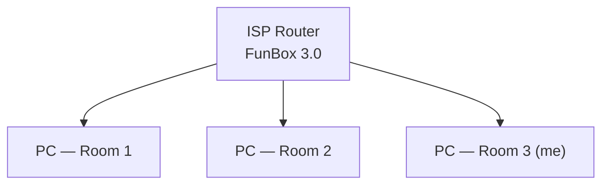
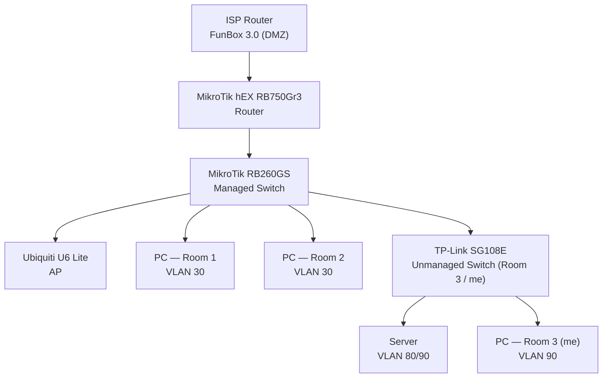
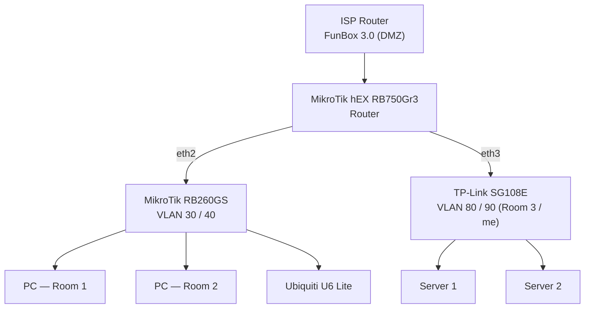

# myNetwork

## Overview

After finishing my degree, I wanted to move from theory to practice and get real, hands-on experience as a network/systems administrator — not because a specific need forced it, but out of a genuine interest in learning by building. That curiosity turned into a self-hosted homelab, and the network became the foundation everything else sits on: I run my own cloud on it, holding personal data, so a flat, unsegmented network was never an option.

This repo documents the redesign of my home network: moving from a single flat LAN behind an ISP router to a segmented, VLAN-based topology with firewall rules that isolate server traffic, flatmate traffic, and guest traffic from each other. Built and maintained as part of a self-hosted homelab.

## Goals

- Take full administrative ownership of the home network instead of relying on the ISP router
- Segment traffic by trust level: personal server/data, my own devices, flatmates, and guests should not share a broadcast domain
- Apply least-privilege access between segments, enforced by firewall rules rather than assumptions
- Keep management access to network devices (router, switch, AP) restricted to a single trusted VLAN
- Build this incrementally on real (used, wiped, verified) enterprise-grade gear instead of a single consumer router/switch combo, to actually learn the concepts rather than have them abstracted away

## Topology

### Before

A single flat LAN with no segmentation — every device shared the same broadcast domain and could reach every other device.



### Iteration 1 — VLAN segmentation on a single switch

Replaced the ISP router's LAN side with a dedicated router and managed switch, and introduced VLANs to separate traffic by trust level. The ISP router now only serves as the WAN handoff (DMZ mode) into the MikroTik router. At this stage, all VLANs — including the high-trust admin/server segment — still shared a single trunk into the RB260GS.



This closed the biggest gap (no more flat LAN), but left the high-trust trunk (VLAN 80/90) physically passing through the same switch as the low-trust room 1/2/guest ports.

### Current — physical separation of trust zones

Moved the admin/server segment onto its own dedicated uplink straight from the router, so the high-trust trunk no longer touches the same physical switch as untrusted ports. This reduces blast radius and removes any L2 attack surface (VLAN hopping, switch spoofing) between the two zones — a compromised or misbehaving port on the RB260GS side has no physical path to the server/admin trunk at all.



The router now has two dedicated downlinks instead of one: `eth2` to the RB260GS (rooms 1/2 + guest AP) and `eth3` to the TP-Link switch (my server infrastructure). The migration went smoothly with no unplanned downtime.

## Hardware

| Device | Role |
|---|---|
| ISP-supplied FunBox 3.0 | WAN handoff, set to DMZ/bridge mode |
| MikroTik hEX RB750Gr3 | Router — inter-VLAN routing, firewall, NAT |
| MikroTik RB260GS | Managed switch — VLAN tagging/trunking for room 1, room 2, guest AP |
| TP-Link SG108E | Unmanaged switch — Room 3 (me) uplink to server + personal PC |
| Ubiquiti U6 Lite | Wireless AP — separate SSIDs mapped to VLAN 30 and VLAN 40 |

All networking hardware was bought used, factory-reset, and verified clean before deployment, rather than buying a single new consumer router/switch combo — a deliberate choice to actually configure and understand enterprise-style gear instead of relying on a black-box appliance.

## VLAN Design

> Addressing below is illustrative (`10.0.<VLAN>.0/24` placeholders), not the real internal scheme — VLAN IDs and the access matrix are accurate.

| VLAN | Name | Members | Access |
|---|---|---|---|
| 30 | Rooms 1 & 2 | Flatmate PCs | Own traffic only |
| 40 | Guest | Guest Wi-Fi (AP) | Own traffic only |
| 80 | Room 3 / Server 1 | My room's non-admin devices + server 1 | Own traffic + everything except VLAN 90 |
| 90 | Admin / Master | My PC, server 2 | Sees everything; not visible to any other VLAN |
| 99 | MGMT | Router, switch, and AP management interfaces only | Reachable only from VLAN 90 |

## Firewall Rules

Segmentation is enforced at two levels on the MikroTik router, since VLANs alone only provide L2 separation — routing between them, and management access, still has to be explicitly restricted.

**Management access (`chain=input`)** — restricts who can reach the router's own services (Winbox/WebFig/SSH), independent of inter-VLAN routing:

```
/interface list add name=MGMT_ALLOWED
/interface list member add list=MGMT_ALLOWED interface=vlan90
/interface list member add list=MGMT_ALLOWED interface=vlan99

/ip firewall filter
add chain=input connection-state=established,related action=accept
add chain=input connection-state=invalid action=drop
add chain=input in-interface-list=MGMT_ALLOWED action=accept
add chain=input protocol=icmp action=accept
add chain=input action=drop
```

**Inter-VLAN routing (`chain=forward`)** — enforces the access matrix in the VLAN table above (`30` and `40` isolated to their own traffic, `80` reaches everything except `90`, `90` reaches everything and is unreachable from the rest):

```
/ip firewall address-list
add list=LAN30 address=10.0.30.0/24
add list=LAN40 address=10.0.40.0/24
add list=LAN80 address=10.0.80.0/24
add list=LAN90 address=10.0.90.0/24

/ip firewall filter
add chain=forward connection-state=established,related action=accept
add chain=forward connection-state=invalid action=drop
add chain=forward src-address-list=LAN90 action=accept
add chain=forward src-address-list=LAN80 dst-address-list=LAN90 action=drop
add chain=forward src-address-list=LAN80 action=accept
add chain=forward src-address-list=LAN30 dst-address-list=LAN40 action=drop
add chain=forward src-address-list=LAN40 dst-address-list=LAN30 action=drop
add chain=forward src-address-list=LAN30 dst-address-list=LAN80 action=drop
add chain=forward src-address-list=LAN40 dst-address-list=LAN80 action=drop
add chain=forward dst-address-list=LAN90 action=drop
add chain=forward action=drop
```

Rule order matters — RouterOS evaluates top to bottom and stops at the first match, so `established/related` and explicit accepts must come before the default drop. Verified after deployment: VLAN 30 can no longer reach the router's management page on the VLAN 90 address, and stays confined to its own segment as intended.

## Lessons Learned

- **A VLAN is L2 separation, not a policy.** Splitting traffic into VLANs doesn't stop the router from routing between them by default — every connected VLAN interface gets an automatic route, so isolation has to be enforced explicitly with firewall rules.
- **`chain=input` vs `chain=forward` are different problems.** Being able to reach the router's own management page (WebFig/Winbox) from a low-trust VLAN is an input-chain gap, not a forward-chain one — I initially only thought about traffic *between* VLANs and missed that access *to the router itself* needed its own rule set.
- **Same-VLAN traffic never touches the router.** Two hosts in the same VLAN communicate purely at L2 through the switch; no router firewall rule can affect that. Isolating individual devices within a VLAN (e.g. two flatmates' PCs) requires switch-level port isolation, not firewall rules.
- **Physical topology is part of the security boundary.** Routing high-trust traffic through the same switch as low-trust ports (even correctly VLAN-tagged) is a smaller design flaw than a config bug — hence the planned move to a dedicated physical uplink for the admin/server segment.

## Planned Improvements

- Prune each uplink to only the VLANs it needs (router↔RB260GS: 30/40; router↔TP-Link: 80/90), instead of carrying every VLAN on both trunks
- Add switch port isolation within VLAN 30 so flatmate devices can't reach each other even on the same VLAN
- Extend firewall logging to confirm the access matrix is enforced as intended
